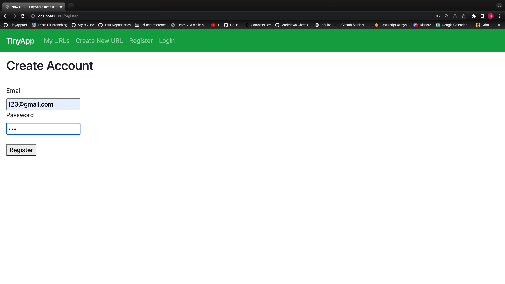
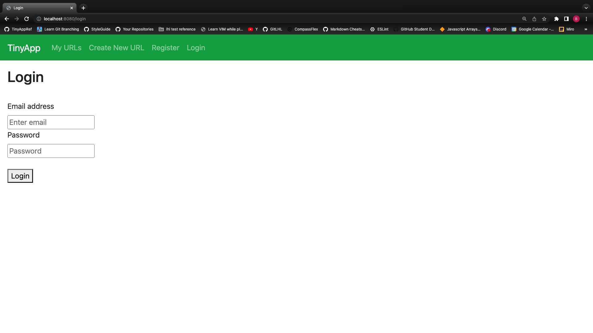

# Brian Bucek's TinyApp assignment with Lighthouse Labs

## Purpose

App designed to register and create short URLs from long URLs, store them in an index, and be able to change them.

## Images

## Dependencies

- EJS
- Express
- cookie-session
- bcrypt

## First Steps

- Install dependencies with npm install command.
- Run the server using the node start command.